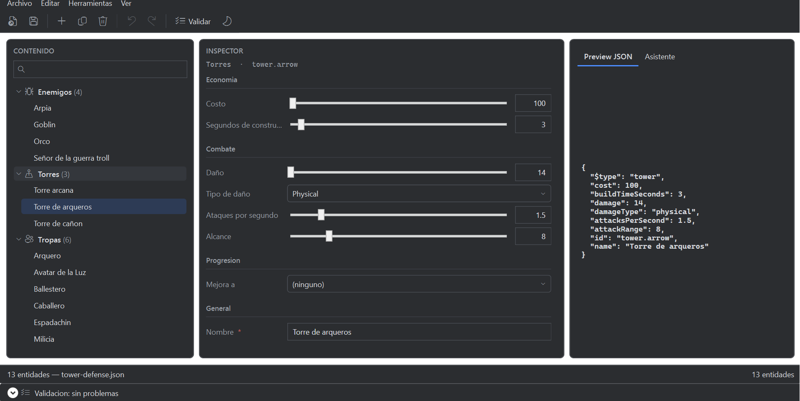
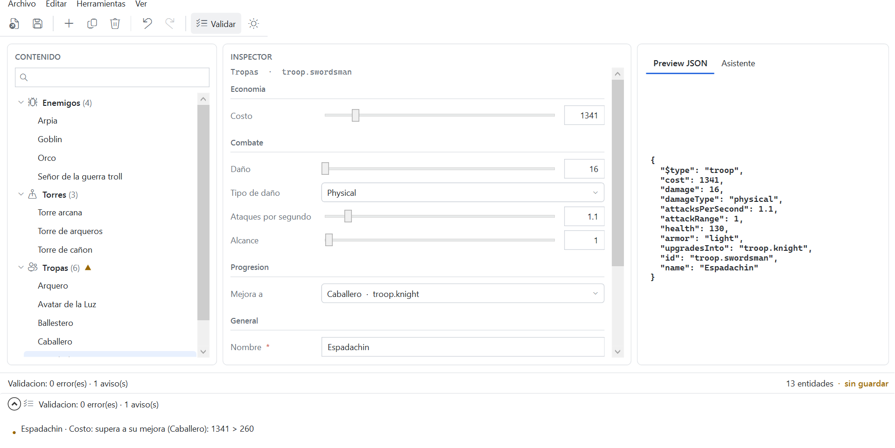
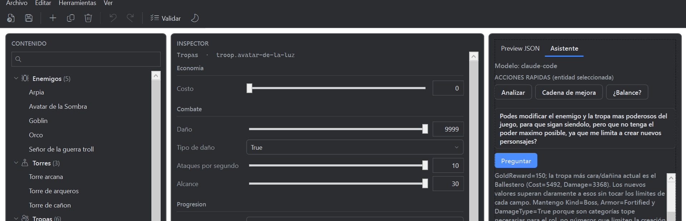
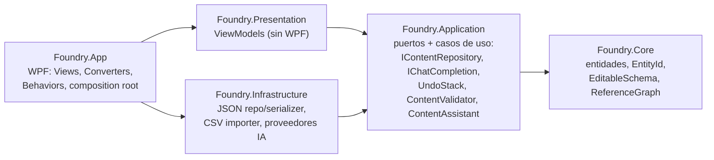

# Foundry

Herramienta de escritorio (**WPF / .NET 8**) para editar y validar el contenido de un juego
tower-defense — tropas, torres, enemigos, cadenas de mejora — antes de exportarlo al JSON que
consume el juego.

El porqué de cada decisión de diseño está en [`docs/adr`](docs/adr).

## El problema

En un F2P los diseñadores balancean números todo el día — costos, daño, vida, curvas de mejora —
y normalmente lo hacen en planillas que después alguien convierte al formato del juego a mano.
Los errores que se cuelan (un costo negativo, una referencia a una entidad que no existe, un valor
fuera del rango que el engine tolera, una "mejora" que es peor que la unidad base) **rompen el
build del juego** o, peor, pasan silenciosamente al balance.

Foundry se mete en el medio: los diseñadores editan cada entidad en un formulario, ven en vivo el
JSON que se va a guardar, y hay validación de todo el game data en un panel siempre visible más un
chequeo completo antes de cerrar.

## Screenshots

| Editor + Inspector | Validación del game data | Asistente con IA |
|---|---|---|
|  |  |  |

## Correr

```bash
dotnet build
dotnet test
dotnet run --project src/Foundry.App
```

Requiere el **.NET 8 SDK**; para desarrollo, Visual Studio 2026 Community con el workload
".NET desktop development". En el primer arranque copia
[`Samples/tower-defense.json`](src/Foundry.App/Samples/tower-defense.json) (12 entidades, con un
"typo" a propósito que la validación detecta) a `Documentos\Foundry\` y lo abre desde ahí. Hay un
[`Samples/extra-troops.csv`](src/Foundry.App/Samples/extra-troops.csv) para probar el importador.

Para el asistente con IA, ver [ADR 0011](docs/adr/0011-asistente-ia.md): por defecto usa un
proveedor `stub` (sin setup ni credenciales); se cambia a `claude-code` / `anthropic` / `ollama`
en `appsettings.json` (o en `appsettings.Local.json`, ignorado por git, ver
[`appsettings.Local.json.example`](src/Foundry.App/appsettings.Local.json.example)). El repo no
lleva ninguna API key: `claude-code` usa la sesión local del CLI y `anthropic` toma la key de
`appsettings.Local.json` o de la variable de entorno `Assistant__ApiKey`.

## Qué hace

- **Árbol de contenido** por categoría, con filtro por nombre o id y contador por categoría.
- **Inspector generado por reflexión**: al seleccionar una entidad arma el formulario solo —
  cuadros de texto, deslizadores con rango, combos de enum, selector de referencias.
- **Crear / duplicar / eliminar** entidades a mano (menú *Editar*, Ctrl+D, Supr). Eliminar avisa
  si algo la referencia.
- **Undo / redo** (Ctrl+Z / Ctrl+Y) sobre toda edición, con *coalescing* (arrastrar un slider = un
  solo paso).
- **Validación en dos capas**: por campo mientras editás (borde rojo + motivo), y del game data
  completo en un **panel siempre visible** — rangos, requeridos, referencias rotas, coherencia de
  cadenas de mejora, ciclos. Un click en un problema lleva a la entidad. Al cerrar corre el
  chequeo completo y avisa si hay errores o cambios sin guardar.
- **Preview JSON en vivo** de la entidad — exactamente lo que se guarda en disco.
- **"Usado por"**: qué entidades referencian a la seleccionada, antes de borrar o renombrar.
- **Importar CSV**: trae entidades de una planilla mapeando columnas al esquema.
- **Asistente con IA**: acciones concretas sobre la entidad abierta ("Analizar", "Cadena de
  mejora", "¿Balance?") o texto libre. El modelo **propone** entidades; el usuario las revisa y
  las aplica con undo. Proveedor intercambiable por config (stub / claude-code / anthropic /
  ollama / **Azure OpenAI · Azure AI Foundry**), con **reintentos + backoff + fallback** y una
  traza por llamada (latencia, tokens y costo estimados). System prompts **versionados** y un
  **harness de evals** con gate de CI — ver [abajo](#el-asistente-prompts-resiliencia-y-evals).
- **Edición libre, guardado explícito**: editás y navegás sin fricción; `Guardar` (Ctrl+S)
  escribe todo el documento. No bloquea por errores de validación (deja guardar trabajo en curso;
  el chequeo duro es al cerrar). `*` en el título mientras hay cambios sin guardar.
- **Recientes** (menú *Archivo*) y **tema claro / oscuro** con toggle en vivo.

## Arquitectura



Las dependencias apuntan hacia adentro. `Core` no referencia a nadie, así que la lógica de dominio
se testea sin instanciar una ventana ni tocar el disco. `Application` define interfaces que
`Infrastructure` implementa: la capa de casos de uso no sabe que la persistencia es JSON. Los
ViewModels viven en `Foundry.Presentation`, sin referencia a WPF, y corren en un runner de consola
normal. El límite lo fuerzan las referencias entre proyectos: MSBuild no deja referencias
circulares ni saltos de capa.

```
Foundry.sln
├── src/
│   ├── Foundry.Core            Dominio: ContentEntity + Troop/Tower/Enemy, EntityId,
│   │                           EditableSchema (reflexión), ReferenceGraph, ContentEntityCatalog,
│   │                           ContentCloner.
│   ├── Foundry.Application     Puertos y casos de uso: IContentRepository, IContentSerializer,
│   │                           IContentImporter, IChatCompletion, ContentAssistant, ContentValidator,
│   │                           UndoStack + acciones (SetFieldValue, AddEntities, RemoveEntities).
│   ├── Foundry.Infrastructure  JSON repo/serializer (polimórficos), CsvContentImporter,
│   │                           proveedores IChatCompletion (stub / anthropic / ollama / claude-code
│   │                           / azure), ResilientChatCompletion (reintentos + fallback + traza),
│   │                           ChatCallLog.
│   ├── Foundry.Presentation    MainViewModel, InspectorViewModel, AssistantViewModel, field VMs.
│   ├── Foundry.App             MainWindow, InspectorView, AssistantView, converters, behaviors,
│   │                           tema, appsettings.json, App.xaml.cs (arma la pila del asistente).
│   └── Foundry.Evals           Harness de evaluación del asistente: casos, EvalRunner, Expect,
│                               fixtures grabados, reporte. Ejecutable + gate en tests/.
└── tests/                      Core / Application / Infrastructure / Presentation / Evals .Tests
```

### Decisiones (ADRs)

| # | Decisión |
|---|---|
| [0001](docs/adr/0001-clean-architecture-cuatro-proyectos.md) | Clean architecture, Infrastructure como proyecto aparte |
| [0002](docs/adr/0002-mvvm-community-toolkit.md) | MVVM con `CommunityToolkit.Mvvm` (source generators) |
| [0003](docs/adr/0003-composicion-generic-host-di.md) | Composición con Generic Host + `Microsoft.Extensions.DependencyInjection` |
| [0004](docs/adr/0004-fluentassertions-7.md) | `FluentAssertions` fijado en 7.2.0 (8.x pasa a licencia paga) |
| [0005](docs/adr/0005-tooling-cpm-analyzers.md) | Central Package Management + analyzers + warnings como errores + C# 12 |
| [0006](docs/adr/0006-json-polimorfico-dominio-limpio.md) | JSON polimórfico sin ensuciar el dominio con atributos |
| [0007](docs/adr/0007-viewmodels-sin-wpf.md) | ViewModels sin WPF; templates implícitos vs `DataTemplateSelector` |
| [0008](docs/adr/0008-undo-redo-y-validacion.md) | Undo/redo (command pattern, coalescing) y validación en dos capas |
| [0009](docs/adr/0009-importadores.md) | `IContentImporter` + CSV dirigido por esquema |
| [0010](docs/adr/0010-theming.md) | Theming: sistema de paleta con Light/Dark en runtime (`ResourceDictionary` + `DynamicResource`) |
| [0011](docs/adr/0011-asistente-ia.md) | Asistente con IA: puerto `IChatCompletion` + proveedor elegido por config |
| [0012](docs/adr/0012-proyecto-multi-archivo.md) | Un archivo por ahora; proyecto multi-archivo pendiente |
| [0013](docs/adr/0013-evals-observabilidad-y-prompts.md) | Evals + gate de CI, resiliencia/telemetría de las llamadas, prompts versionados |

## El Inspector por reflexión

En lugar de escribir un formulario por tipo de entidad, las entidades se anotan:

```csharp
[EditableProperty(Label = "Daño", Group = "Combate", Order = 0, Progression = true)]
[Range(0, 9999)]
public int Damage { get; set; }

[EditableProperty(Label = "Mejora a", Group = "Progresión")]
[AssetReference(typeof(Troop))]
public EntityId? UpgradesInto { get; set; }
```

`EditableSchema.For(type)` reflexiona una vez por tipo (cacheado) y produce `EditableField`s con
etiqueta, grupo, orden, `FieldKind`, rango y tipo referenciado. `InspectorViewModel` la recorre y
crea un `PropertyFieldViewModel` por campo; cada subtipo tiene su `DataTemplate` implícito en
`InspectorView.xaml`. El getter lee de la entidad; el setter encola un `SetFieldValueAction` en el
`UndoStack`. `Progression = true` marca los stats que la validación exige que mejoren a lo largo de
una cadena de mejora.

### Agregar una entidad nueva

1. Escribir la clase: `public sealed class Trap : ContentEntity`.
2. `override CategoryName => "Trampas";`
3. Anotar sus propiedades con `[EditableProperty]` / `[Range]` / `[AssetReference]`.

Con eso, el árbol la agrupa, el Inspector le arma el formulario, y la serialización JSON, el
importador CSV, el menú *Nueva entidad* y el prompt del asistente la reconocen por reflexión
(`ContentEntityCatalog` + `SchemaDescription`). No hay que tocar UI, serialización ni ningún
registro manual.

## El asistente: prompts, resiliencia y evals

El [ADR 0013](docs/adr/0013-evals-observabilidad-y-prompts.md) tiene el detalle. En corto:

**System prompts versionados.** Salen del código y viven como recursos en
`src/Foundry.Application/Ai/Prompts/assistant-system.v{N}.txt`, con marcadores `{schema}` que se
completan en runtime. `ContentAssistant` recibe la versión a usar (`Assistant:PromptVersion`, id o
familia → última) y la propaga en `AssistantResult.PromptId`. `v2` es más estricto que `v1`
(JSON-only, "no inventes campos", few-shot); el harness mide una contra otra.

**Resiliencia + telemetría.** `ResilientChatCompletion` envuelve a cualquier proveedor y agrega,
sin que el resto de la app se entere: reintentos con backoff exponencial, fallback a un segundo
proveedor (`Assistant:Fallback`), y una `ChatCallReport` por llamada — proveedor, duración,
intentos, tokens y costo estimados. `ChatCallLog` la guarda en memoria y como JSON Lines en
`%APPDATA%\Foundry\chat-calls.jsonl`. Es el único `IChatCompletion` que ve la app; el proveedor
crudo (incluido el de **Azure OpenAI / Azure AI Foundry**) queda detrás.

**Harness de evals.** `Foundry.Evals` corre casos contra la misma pila que la app:

```
dotnet run --project src/Foundry.Evals -- run                       # fixtures grabados (lo del gate)
dotnet run --project src/Foundry.Evals -- run --provider claude-code --prompt assistant-system@v2 --reps 5
dotnet run --project src/Foundry.Evals -- record --provider claude-code   # regenera fixtures
```

Cada `EvalCase` fija un pedido, la base de la que parte y afirmaciones deterministas (`Expect.*`:
propone / no propone, entidades válidas vía `ContentValidator`, id en convención, campo en rango,
mantiene el id al modificar, respuesta JSON-only, latencia y costo bajo umbral). Cada caso se
corre N veces y **pasa si su pass rate ≥ umbral** — la no-determinación está en el modelo, no en
la verificación. El gate de CI (`Foundry.Evals.Tests`, dentro de `dotnet test`) usa `RecordedChat`
con respuestas grabadas: determinista y sin red, detecta regresiones de parser / esquema / prompt.
`azure-pipelines.yml` corre el gate y publica el reporte (`EvalReportRenderer` → Markdown + JSON);
el stage `evals_live` pega contra un modelo real con un secret.

## Testing

`xUnit` + `FluentAssertions`. 122 tests, sobre todo de la lógica de validación, undo/redo, el
schema por reflexión y el asistente (parser, resiliencia, telemetría, gate de evals).

| Proyecto | Cubre |
|---|---|
| Core | `EntityId`, `ContentDatabase`, `EditableSchema` (inferencia de `FieldKind`, rango, referencias, cache), `ReferenceGraph`, `ContentCloner` |
| Application | `UndoStack` + coalescing, `SetFieldValueAction`, `Add/RemoveEntitiesAction`, `ContentValidator` (rango / requerido / referencia rota / cadena de mejora / ciclos) |
| Application | (…) + `PromptLibrary` / `PromptTemplate` (carga de recursos, resolución por id/familia, render), `ChatTokens` / `ModelPricing` (estimación de tokens y costo) |
| Infrastructure | round-trip JSON, polimorfismo `$type`, tipo desconocido, PascalCase de un modelo, importador CSV (mapeo por nombre/etiqueta, comillas, errores con línea), `ContentAssistant` (parseo, fences, entidades inválidas, versión de prompt), `ResilientChatCompletion` (passthrough, reintentos, fallback, fallo total, costo por proveedor, listener que lanza), `ChatCallLog` (ring buffer, JSON Lines, ruta inválida) |
| Presentation | `MainViewModel` (árbol, selección, dirty por profundidad de pila, guardado + "guardar como" del ejemplo, undo/redo, filtro, new/duplicate/delete, panel de validación, navegación a un issue, aplicar propuesta de IA, tema), `InspectorViewModel`, `AssistantViewModel` (habilitación, propuesta, acciones rápidas, errores). Sin runner de WPF gracias al split de assemblies |
| Evals | Gate: cada caso del catálogo contra su fixture grabado alcanza su umbral de pass rate; el run completo produce reporte Markdown/JSON |

## Fuera de alcance

- **Editor de grafo** (diálogos / skill trees con nodos): mucho rendering custom para poco a
  cambio en un proyecto de este tamaño.
- **Librería de UI de terceros** (MahApps, Material, etc.): el tema y los `ControlTemplate` se
  hacen a mano con `ResourceDictionary` ([ADR 0010](docs/adr/0010-theming.md)).
- **`DataTemplateSelector`**: los templates de campo se eligen por tipo de ViewModel, no por un
  valor en runtime; para eso alcanzan los templates implícitos.
- **Integración con Perforce / pipeline de build real**: queda como extensión.

## Qué haría después

- **Concepto de proyecto** ([ADR 0012](docs/adr/0012-proyecto-multi-archivo.md)): hoy se edita
  **un archivo** = un juego. Para varios juegos, o para contenido de un juego partido en varios
  archivos, haría falta un `game.foundryproj` + un selector de proyectos recientes. El cambio duro
  es que `MainViewModel` asume "un archivo abierto".
- **Importación CSV undoable**: reusar `AddEntitiesAction` (hoy la importación limpia el historial).
- **`Exportar` con gate duro**: separar "guardar" (siempre) de "exportar al juego" (bloquea si
  hay errores). Hoy el chequeo duro es solo un aviso al cerrar ([ADR 0008](docs/adr/0008-undo-redo-y-validacion.md)).
- **Workflow de guardado por entidad**: prototipo en la rama `save-workflow-wip` (transacción por
  entidad, revertir al cambiar de selección) — se pausó por ser un modelo mental poco intuitivo.
- **Streaming** en el asistente y few-shot examples en el prompt para modelos chicos.
- **Fine-tuning** de un modelo local con el contenido ya balanceado del estudio.
- **Empaquetado**: MSIX + auto-update para distribuir la herramienta al equipo.

## Licencia

Proyecto personal de Juan Martín Lacal de Castro, publicado sólo para evaluación. Ver
[`LICENSE`](LICENSE).
