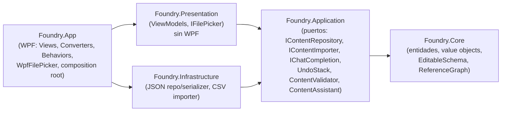

# Foundry

Herramienta interna de escritorio (WPF / .NET 8) para editar y validar el **contenido de un
juego tower-defense / estrategia** — tropas, torres, enemigos, arboles de mejora, curvas de
economia — antes de exportarlo al JSON que consume el juego.

Pensada como el tipo de tool que un equipo de diseño usa a diario para iterar balanceo sin
tocar el engine.

> Proyecto de portfolio para una entrevista de **Tools Engineer (C# / WPF)**. El objetivo no es
> la cantidad de features sino mostrar como estructurar una herramienta interna: arquitectura,
> testabilidad y decisiones justificadas (ver [`docs/adr`](docs/adr)).

## Estado

| | |
|---|---|
| Build | `dotnet build` — OK, 0 warnings |
| Tests | `dotnet test` — 70/70 |
| Fase | Dias 0–4 + coherencia de cadenas de mejora + asistente con IA. |

## Correr

```bash
dotnet build
dotnet test
dotnet run --project src/Foundry.App
```

Requiere el **.NET 8 SDK**. Para desarrollo, Visual Studio 2026 Community con el workload
".NET desktop development". Al arrancar carga
[`Samples/tower-defense.json`](src/Foundry.App/Samples/tower-defense.json) (12 entidades) para
tener algo que mostrar; hay tambien un
[`Samples/extra-troops.csv`](src/Foundry.App/Samples/extra-troops.csv) para probar el importador
(_Archivo → Importar CSV_).

## Que hace

- **Arbol de contenido** por categoria (Tropas / Torres / Enemigos), con filtro por nombre o id.
- **Inspector** generado por reflexion: al seleccionar una entidad arma el formulario solo
  (cuadros de texto, deslizadores con rango, combos de enum, selector de referencias).
- **Preview JSON en vivo** de la entidad — exactamente lo que se guardaria en disco.
- **Undo / redo** (Ctrl+Z / Ctrl+Y) sobre cualquier edicion.
- **Validacion**: por campo mientras editas (borde rojo + motivo) y de la base entera al guardar
  (rango, requerido, referencias rotas) — el guardado se bloquea si hay problemas.
- **"Usado por"**: quien referencia la entidad seleccionada, antes de borrar o renombrar.
- **Importar CSV**: trae entidades desde una planilla, mapeando columnas al esquema.
- **Cambios sin guardar**: `*` en el titulo y prompt al abrir otro archivo o cerrar.
- **Coherencia de cadenas de mejora**: una entidad no puede superar en daño/vida/costo a la que
  declara como "mejora a" (aviso, no bloquea); detecta ciclos.
- **Panel asistente**: pedís en lenguaje natural, el modelo propone entidades (revisás y aplicás,
  con undo) o responde. Proveedor intercambiable por config — ver
  [ADR 0011](docs/adr/0011-asistente-ia.md).

## Arquitectura



**La regla de dependencias apunta siempre hacia adentro.** `Core` no referencia a nadie, asi que
la logica de dominio se testea sin instanciar una ventana ni tocar el disco. `Application` define
interfaces que `Infrastructure` implementa: la capa de casos de uso no sabe que la persistencia
es JSON. Los **ViewModels viven en `Foundry.Presentation` sin referencia a WPF** y se testean con
un runner de consola normal. El limite se **fuerza con los proyectos**: MSBuild no permite
referencias circulares ni saltos de capa.

```
Foundry.sln
├── src/
│   ├── Foundry.Core            Dominio: ContentEntity + Troop/Tower/Enemy, EntityId,
│   │                           EditableSchema (reflexion), ReferenceGraph, ContentEntityCatalog.
│   ├── Foundry.Application     Puertos y casos de uso: IContentRepository, IContentSerializer,
│   │                           IContentImporter, IChatCompletion, ContentAssistant, ContentValidator,
│   │                           UndoStack + acciones (SetFieldValue, AddEntities).
│   ├── Foundry.Infrastructure  JSON repo/serializer (polimorficos), CsvContentImporter,
│   │                           proveedores IChatCompletion (stub / anthropic / ollama / claude-code).
│   ├── Foundry.Presentation    MainViewModel, InspectorViewModel, AssistantViewModel, field VMs.
│   └── Foundry.App             MainWindow, InspectorView, AssistantView, converters, behaviors,
│                               tema, appsettings.json, App.xaml.cs (elige el proveedor de IA).
└── tests/                      Core / Application / Infrastructure / Presentation .Tests
```

### Decisiones (ADRs)

| # | Decision |
|---|---|
| [0001](docs/adr/0001-clean-architecture-cuatro-proyectos.md) | Clean architecture, Infrastructure como proyecto aparte |
| [0002](docs/adr/0002-mvvm-community-toolkit.md) | MVVM con `CommunityToolkit.Mvvm` (source generators) |
| [0003](docs/adr/0003-composicion-generic-host-di.md) | Composicion con Generic Host + `Microsoft.Extensions.DependencyInjection` |
| [0004](docs/adr/0004-fluentassertions-7.md) | `FluentAssertions` fijado en 7.2.0 (8.x pasa a licencia paga) |
| [0005](docs/adr/0005-tooling-cpm-analyzers.md) | Central Package Management + analyzers + warnings como errores + C# 12 |
| [0006](docs/adr/0006-json-polimorfico-dominio-limpio.md) | JSON polimorfico sin ensuciar el dominio con atributos |
| [0007](docs/adr/0007-viewmodels-sin-wpf.md) | ViewModels sin WPF; templates implicitos vs `DataTemplateSelector` |
| [0008](docs/adr/0008-undo-redo-y-validacion.md) | Undo/redo (command pattern) y validacion en dos capas |
| [0009](docs/adr/0009-importadores.md) | `IContentImporter` + CSV dirigido por esquema |
| [0010](docs/adr/0010-theming.md) | Pasada de diseño clara, sin tema oscuro |
| [0011](docs/adr/0011-asistente-ia.md) | Asistente con IA: puerto `IChatCompletion` + proveedor elegido por config |
| [0012](docs/adr/0012-proyecto-multi-archivo.md) | Un archivo por ahora; concepto de proyecto multi-archivo pendiente |

## El nucleo: el Inspector por reflexion

En lugar de escribir un formulario por tipo de entidad, las entidades se anotan:

```csharp
[EditableProperty(Label = "Daño", Group = "Combate", Order = 0)]
[Range(0, 9999)]
public int Damage { get; set; }

[EditableProperty(Label = "Mejora a", Group = "Progresion")]
[AssetReference(typeof(Troop))]
public EntityId? UpgradesInto { get; set; }
```

`EditableSchema.For(type)` reflexiona una vez por tipo (cacheado) y produce `EditableField`s con
etiqueta, grupo, orden, `FieldKind`, rango y tipo referenciado. `InspectorViewModel` la recorre y
crea un `PropertyFieldViewModel` por campo. Cada subtipo tiene su `DataTemplate` implicito en
`InspectorView.xaml`. El getter de cada campo lee de la entidad; el setter encola un
`SetFieldValueAction` en el `UndoStack`.

### Agregar una entidad nueva

1. Escribir la clase: `public sealed class Trap : ContentEntity`.
2. `override CategoryName => "Trampas";`
3. Anotar sus propiedades con `[EditableProperty]` / `[Range]` / `[AssetReference]`.

Eso es todo. El arbol la agrupa, el Inspector le arma el formulario, la serializacion JSON, el
importador CSV **y el prompt del asistente** la reconocen por reflexion (`ContentEntityCatalog`
+ `SchemaDescription`). **Cero UI, cero serializacion, cero registro manual.**

## Testing

`xUnit` + `FluentAssertions`. 70 tests.

| Proyecto | Cubre |
|---|---|
| Core | `EntityId`, `ContentDatabase`, `EditableSchema` (inferencia de `FieldKind`, rango, referencias, cache), `ReferenceGraph` (referrers / links rotos) |
| Application | `UndoStack`, `SetFieldValueAction`, `ContentValidator` (rango / requerido / referencia rota) |
| Infrastructure | round-trip JSON, polimorfismo `$type`, tipo desconocido, importador CSV (mapeo por nombre/etiqueta, comillas, errores con linea), `ContentAssistant` (parseo de respuestas, fences, entidades invalidas) |
| Presentation | `InspectorViewModel`, `MainViewModel` (arbol, seleccion, dirty, save bloqueado, undo/redo, filtro). Sin runner de WPF gracias al split de assemblies |

## Fuera de alcance (a proposito)

- **Editor de grafo** (dialogos / skill trees con nodos): mucho tiempo en rendering custom, poco
  en la historia de ingenieria.
- **Libreria de UI de terceros**: el tema se hace con `ResourceDictionary` para mostrar dominio
  de recursos y estilos ([ADR 0010](docs/adr/0010-theming.md)).
- **Tema oscuro completo**: necesita `ControlTemplate`s o una libreria. La paleta con nombre lo
  deja como trabajo futuro acotado.
- **`DataTemplateSelector`**: los templates de campo se eligen por tipo de ViewModel, no por un
  valor en runtime — para eso los templates implicitos son la herramienta correcta.
- **Integracion con Perforce / pipeline de build real**: se menciona como extension.

## Que haria despues

- **Concepto de proyecto** ([ADR 0012](docs/adr/0012-proyecto-multi-archivo.md)): hoy se edita
  **un archivo** = el contenido de un juego. Para varios juegos, o para contenido de un juego
  partido en varios archivos (`troops.json`, `waves.json`, `liveops.json`), haria falta un
  `game.foundryproj` (nombre + lista de archivos + settings) y un selector de proyectos recientes.
  El cambio duro es que `MainViewModel` asume "un archivo abierto": guardar tiene que saber a que
  archivo pertenece cada entidad.
- **Lista de recientes** (paso previo, chico): menu *Archivo → Recientes*, cubre 2-10 juegos de
  un archivo cada uno.
- **Importacion CSV undoable**: reusar `AddEntitiesAction` (ya lo usa el asistente).
- **Validacion del archivo entero siempre visible** (panel lateral), no solo al guardar / bajo menu.
- **Streaming** en el panel del asistente y few-shot examples en el prompt para mejorar el JSON
  de los modelos chicos.
- **Fine-tuning** de un modelo local con el contenido ya balanceado del estudio (aprende las
  convenciones de costos/stats por tier).
- **Empaquetado**: MSIX + auto-update para distribuir la herramienta al equipo.
