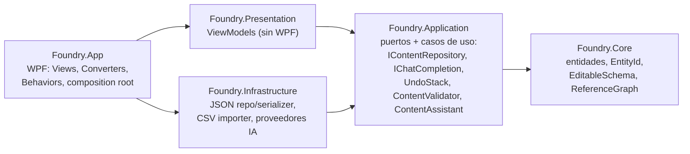

# Foundry

Herramienta interna de escritorio (**WPF / .NET 8**) para editar y validar el contenido de un
juego tower-defense/estrategia — tropas, torres, enemigos, cadenas de mejora — antes de exportarlo
al JSON que consume el juego.

> Proyecto de portfolio para una entrevista de **Tools Engineer (C# / WPF)**. El foco no es la
> cantidad de features sino cómo se estructura una herramienta interna: arquitectura defendible,
> lógica testeable y decisiones justificadas (12 ADRs en [`docs/adr`](docs/adr)).

## El problema

En un F2P los diseñadores balancean números todo el día — costos, daño, vida, curvas de mejora —
y normalmente lo hacen en planillas que después alguien convierte al formato del juego a mano.
Los errores que se cuelan (un costo negativo, una referencia a una entidad que no existe, un valor
fuera del rango que el engine tolera, una "mejora" que es peor que la unidad base) **rompen el
build del juego** o, peor, pasan silenciosamente al balance.

**Foundry** es la herramienta que se mete en el medio: los diseñadores editan el contenido con un
formulario por entidad, ven en vivo el JSON que se va a guardar, y la herramienta **valida el
game data completo** y bloquea el guardado si hay algo que rompería el pipeline.

## Screenshots

> _Pendiente: capturar 3 — (1) ventana principal con una entidad seleccionada en el Inspector,
> (2) el panel de validación con un error y un aviso, (3) la pestaña Asistente con una propuesta.
> Guardarlas en `docs/img/` y enlazarlas acá._

## Correr

```bash
dotnet build
dotnet test
dotnet run --project src/Foundry.App
```

Requiere el **.NET 8 SDK**; para desarrollo, Visual Studio 2026 Community con el workload
".NET desktop development". Al arrancar carga
[`Samples/tower-defense.json`](src/Foundry.App/Samples/tower-defense.json) (12 entidades, con un
"typo" a propósito que la validación detecta) y hay un
[`Samples/extra-troops.csv`](src/Foundry.App/Samples/extra-troops.csv) para probar el importador.

Para el asistente con IA, ver [ADR 0011](docs/adr/0011-asistente-ia.md): por defecto usa un
proveedor `stub` (sin setup); se cambia a `claude-code` / `anthropic` / `ollama` en
`appsettings.json`.

## Qué hace

- **Árbol de contenido** por categoría, con filtro por nombre o id y contador por categoría.
- **Inspector generado por reflexión**: al seleccionar una entidad arma el formulario solo —
  cuadros de texto, deslizadores con rango, combos de enum, selector de referencias.
- **Crear / duplicar / eliminar** entidades a mano (menú *Editar*, Ctrl+D, Supr). Eliminar avisa
  si algo la referencia.
- **Undo / redo** (Ctrl+Z / Ctrl+Y) sobre toda edición, con *coalescing* (arrastrar un slider = un
  solo paso).
- **Validación en dos capas**: por campo mientras editás (borde rojo + motivo), y del game data
  completo en un **panel siempre visible** — rangos, requeridos, referencias rotas, coherencia de
  cadenas de mejora, ciclos. Un click en un problema lleva a la entidad. Los errores **bloquean el
  guardado**; los avisos de balance no.
- **Preview JSON en vivo** de la entidad — exactamente lo que se guarda en disco.
- **"Usado por"**: qué entidades referencian a la seleccionada, antes de borrar o renombrar.
- **Importar CSV**: trae entidades de una planilla mapeando columnas al esquema.
- **Asistente con IA**: acciones concretas sobre la entidad abierta ("Analizar", "Cadena de
  mejora", "¿Balance?") o texto libre. El modelo **propone** entidades; el usuario las revisa y
  las aplica con undo. Proveedor intercambiable por config.
- **Cambios sin guardar**: `*` en el título, contador en la status bar, prompt al abrir/cerrar.

## Arquitectura



**La regla de dependencias apunta siempre hacia adentro.** `Core` no referencia a nadie, así que
la lógica de dominio se testea sin instanciar una ventana ni tocar el disco. `Application` define
interfaces que `Infrastructure` implementa: la capa de casos de uso no sabe que la persistencia es
JSON. Los **ViewModels viven en `Foundry.Presentation`, sin referencia a WPF**, y se testean con un
runner de consola normal. El límite se **fuerza con los proyectos**: MSBuild no permite referencias
circulares ni saltos de capa.

```
Foundry.sln
├── src/
│   ├── Foundry.Core            Dominio: ContentEntity + Troop/Tower/Enemy, EntityId,
│   │                           EditableSchema (reflexión), ReferenceGraph, ContentEntityCatalog,
│   │                           ContentCloner.
│   ├── Foundry.Application     Puertos y casos de uso: IContentRepository, IContentSerializer,
│   │                           IContentImporter, IChatCompletion, ContentAssistant, ContentValidator,
│   │                           UndoStack + acciones (SetFieldValue, AddEntities, RemoveEntities).
│   ├── Foundry.Infrastructure  JSON repo/serializer (polimórficos), CsvContentImporter,
│   │                           proveedores IChatCompletion (stub / anthropic / ollama / claude-code).
│   ├── Foundry.Presentation    MainViewModel, InspectorViewModel, AssistantViewModel, field VMs.
│   └── Foundry.App             MainWindow, InspectorView, AssistantView, converters, behaviors,
│                               tema, appsettings.json, App.xaml.cs (elige el proveedor de IA).
└── tests/                      Core / Application / Infrastructure / Presentation .Tests
```

### Decisiones (ADRs)

| # | Decisión |
|---|---|
| [0001](docs/adr/0001-clean-architecture-cuatro-proyectos.md) | Clean architecture, Infrastructure como proyecto aparte |
| [0002](docs/adr/0002-mvvm-community-toolkit.md) | MVVM con `CommunityToolkit.Mvvm` (source generators) |
| [0003](docs/adr/0003-composicion-generic-host-di.md) | Composición con Generic Host + `Microsoft.Extensions.DependencyInjection` |
| [0004](docs/adr/0004-fluentassertions-7.md) | `FluentAssertions` fijado en 7.2.0 (8.x pasa a licencia paga) |
| [0005](docs/adr/0005-tooling-cpm-analyzers.md) | Central Package Management + analyzers + warnings como errores + C# 12 |
| [0006](docs/adr/0006-json-polimorfico-dominio-limpio.md) | JSON polimórfico sin ensuciar el dominio con atributos |
| [0007](docs/adr/0007-viewmodels-sin-wpf.md) | ViewModels sin WPF; templates implícitos vs `DataTemplateSelector` |
| [0008](docs/adr/0008-undo-redo-y-validacion.md) | Undo/redo (command pattern, coalescing) y validación en dos capas |
| [0009](docs/adr/0009-importadores.md) | `IContentImporter` + CSV dirigido por esquema |
| [0010](docs/adr/0010-theming.md) | Pasada de diseño clara, sin tema oscuro |
| [0011](docs/adr/0011-asistente-ia.md) | Asistente con IA: puerto `IChatCompletion` + proveedor elegido por config |
| [0012](docs/adr/0012-proyecto-multi-archivo.md) | Un archivo por ahora; proyecto multi-archivo pendiente |

## El núcleo: el Inspector por reflexión

En lugar de escribir un formulario por tipo de entidad, las entidades se anotan:

```csharp
[EditableProperty(Label = "Daño", Group = "Combate", Order = 0, Progression = true)]
[Range(0, 9999)]
public int Damage { get; set; }

[EditableProperty(Label = "Mejora a", Group = "Progresión")]
[AssetReference(typeof(Troop))]
public EntityId? UpgradesInto { get; set; }
```

`EditableSchema.For(type)` reflexiona una vez por tipo (cacheado) y produce `EditableField`s con
etiqueta, grupo, orden, `FieldKind`, rango y tipo referenciado. `InspectorViewModel` la recorre y
crea un `PropertyFieldViewModel` por campo; cada subtipo tiene su `DataTemplate` implícito en
`InspectorView.xaml`. El getter lee de la entidad; el setter encola un `SetFieldValueAction` en el
`UndoStack`. `Progression = true` marca los stats que la validación exige que mejoren a lo largo de
una cadena de mejora.

### Agregar una entidad nueva

1. Escribir la clase: `public sealed class Trap : ContentEntity`.
2. `override CategoryName => "Trampas";`
3. Anotar sus propiedades con `[EditableProperty]` / `[Range]` / `[AssetReference]`.

Eso es todo. El árbol la agrupa, el Inspector le arma el formulario, la serialización JSON, el
importador CSV, el menú *Nueva entidad* **y el prompt del asistente** la reconocen por reflexión
(`ContentEntityCatalog` + `SchemaDescription`). **Cero UI, cero serialización, cero registro
manual.**

## Testing

`xUnit` + `FluentAssertions`. **86 tests**, sobre comportamiento real (no getters triviales).

| Proyecto | Cubre |
|---|---|
| Core | `EntityId`, `ContentDatabase`, `EditableSchema` (inferencia de `FieldKind`, rango, referencias, cache), `ReferenceGraph`, `ContentCloner` |
| Application | `UndoStack` + coalescing, `SetFieldValueAction`, `Add/RemoveEntitiesAction`, `ContentValidator` (rango / requerido / referencia rota / cadena de mejora / ciclos) |
| Infrastructure | round-trip JSON, polimorfismo `$type`, tipo desconocido, PascalCase de un modelo, importador CSV (mapeo por nombre/etiqueta, comillas, errores con línea), `ContentAssistant` (parseo, fences, entidades inválidas) |
| Presentation | `MainViewModel` (árbol, selección, dirty, save bloqueado, undo/redo, filtro, new/duplicate/delete, panel de validación, navegación a un issue), `InspectorViewModel`, `AssistantViewModel` (habilitación, propuesta, acciones rápidas, errores). Sin runner de WPF gracias al split de assemblies |

## Fuera de alcance (a propósito)

- **Editor de grafo** (diálogos / skill trees con nodos): mucho tiempo en rendering custom, poco
  en la historia de ingeniería.
- **Librería de UI de terceros / tema oscuro completo**: el tema se hace con `ResourceDictionary`
  para mostrar dominio de recursos y estilos ([ADR 0010](docs/adr/0010-theming.md)).
- **`DataTemplateSelector`**: los templates de campo se eligen por tipo de ViewModel, no por un
  valor en runtime — para eso los templates implícitos son la herramienta correcta.
- **Integración con Perforce / pipeline de build real**: se menciona como extensión.

## Qué haría después

- **Concepto de proyecto** ([ADR 0012](docs/adr/0012-proyecto-multi-archivo.md)): hoy se edita
  **un archivo** = un juego. Para varios juegos, o para contenido de un juego partido en varios
  archivos, haría falta un `game.foundryproj` + un selector de proyectos recientes. El cambio duro
  es que `MainViewModel` asume "un archivo abierto".
- **Lista de recientes** (paso previo, chico): menú *Archivo → Recientes*.
- **Importación CSV undoable**: reusar `AddEntitiesAction`.
- **Streaming** en el asistente y few-shot examples en el prompt para modelos chicos.
- **Fine-tuning** de un modelo local con el contenido ya balanceado del estudio.
- **Empaquetado**: MSIX + auto-update para distribuir la herramienta al equipo.
