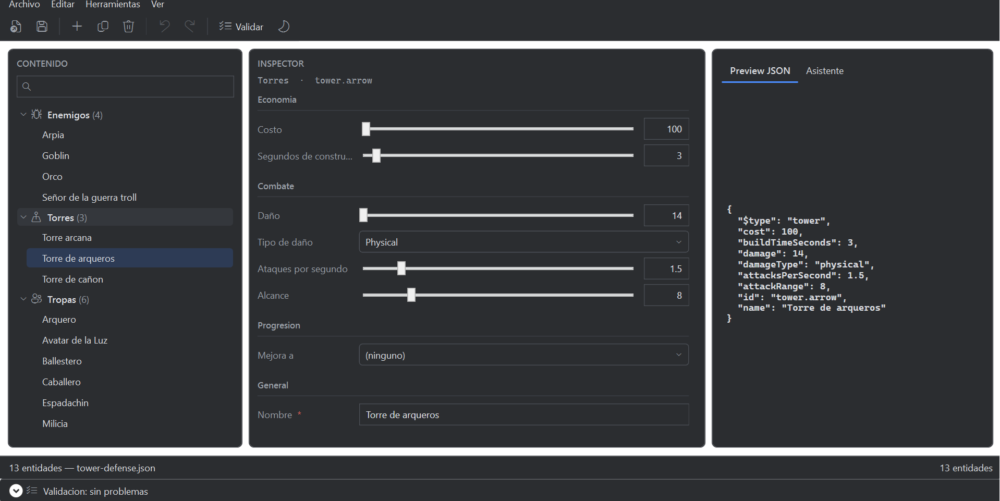
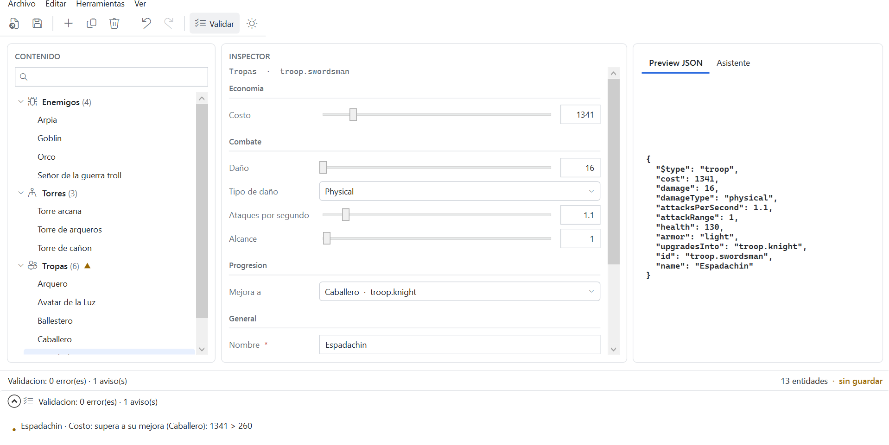
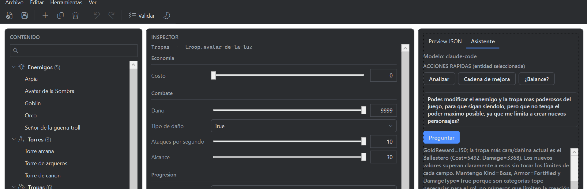
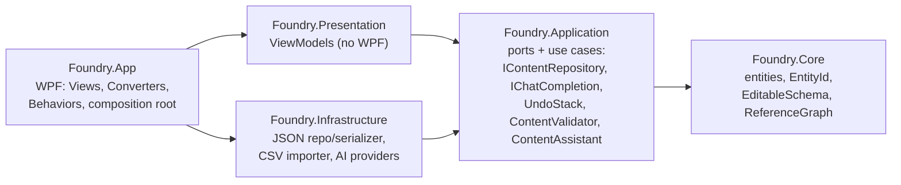

# Foundry

Desktop tool (**WPF / .NET 8**) for editing and validating the content of a tower-defense game —
troops, towers, enemies, upgrade chains — before exporting it to the JSON the game consumes.

What it demonstrates: clean architecture with real MVVM, reflection-driven UI, undo/redo, two-layer
validation, and an LLM assistant behind a swappable provider with retries, fallback, telemetry,
versioned prompts and an evaluation harness gated in CI.

The reasoning behind each design decision is in [`docs/adr`](docs/adr) (written in Spanish).

## The problem

In a free-to-play game, designers balance numbers all day — costs, damage, health, upgrade
curves — usually in spreadsheets that someone later converts to the game's format by hand. The
errors that slip through (a negative cost, a reference to an entity that doesn't exist, a value
outside the range the engine tolerates, an "upgrade" that is worse than the base unit) **break the
game build** or, worse, silently make it into the balance.

Foundry sits in between: designers edit each entity in a form, see the JSON that will be saved in
real time, and the whole game data is validated in an always-visible panel plus a full check before
closing.

## Screenshots

| Editor + Inspector | Game data validation | AI assistant |
|---|---|---|
|  |  |  |

The app UI is in Spanish.

## Running it

```bash
dotnet build
dotnet test
dotnet run --project src/Foundry.App
```

Requires the **.NET 8 SDK**; for development, Visual Studio 2026 Community with the ".NET desktop
development" workload. On first launch it copies
[`Samples/tower-defense.json`](src/Foundry.App/Samples/tower-defense.json) (12 entities, with a
deliberate "typo" that validation catches) to `Documents\Foundry\` and opens it from there. There is
also a [`Samples/extra-troops.csv`](src/Foundry.App/Samples/extra-troops.csv) to try the importer.

For the AI assistant, see [ADR 0011](docs/adr/0011-asistente-ia.md): by default it uses a `stub`
provider (no setup or credentials); switch to `claude-code` / `anthropic` / `ollama` / `azure` in
`appsettings.json` (or in `appsettings.Local.json`, ignored by git — see
[`appsettings.Local.json.example`](src/Foundry.App/appsettings.Local.json.example)). The repo
contains no API keys: `claude-code` uses the local CLI session, and `anthropic` / `azure` read the
key from `appsettings.Local.json` or from the `Assistant__ApiKey` environment variable.

## Features

- **Content tree** by category, with filtering by name or id and a per-category count.
- **Reflection-generated Inspector**: selecting an entity builds its form automatically — text
  boxes, ranged sliders, enum combos, reference pickers.
- **Create / duplicate / delete** entities by hand (*Edit* menu, Ctrl+D, Del). Deleting warns if
  something references the entity.
- **Undo / redo** (Ctrl+Z / Ctrl+Y) over every edit, with *coalescing* (dragging a slider = a single
  step).
- **Two-layer validation**: per field while editing (red border + reason), and over the whole game
  data in an **always-visible panel** — ranges, required fields, broken references, upgrade-chain
  consistency, cycles. Clicking an issue navigates to the entity. On close, the full check runs and
  warns about errors or unsaved changes.
- **Live JSON preview** of the entity — exactly what gets written to disk.
- **"Used by"**: which entities reference the selected one, before deleting or renaming it.
- **CSV import**: brings entities in from a spreadsheet, mapping columns to the schema.
- **AI assistant**: concrete actions on the open entity ("Analyze", "Upgrade chain", "Balance?")
  or free text. The model **proposes** entities; the user reviews them and applies them with undo.
  Provider swappable via config (stub / claude-code / anthropic / ollama /
  **Azure OpenAI · Azure AI Foundry**), with **retries + backoff + fallback** and a per-call trace
  (latency, estimated tokens and cost). **Versioned** system prompts and an **evaluation harness**
  gated in CI — see [below](#the-assistant-prompts-resilience-and-evals).
- **Free editing, explicit save**: edit and navigate without friction; `Save` (Ctrl+S) writes the
  whole document. Validation errors don't block saving (work in progress can be saved; the hard
  check happens on close). `*` in the title while there are unsaved changes.
- **Recent files** (*File* menu) and **light / dark theme** with a live toggle.

## Architecture


```mermaid
flowchart LR
    App["Foundry.App<br/>WPF: Views, Converters,<br/>Behaviors, composition root"]
    Pres["Foundry.Presentation<br/>ViewModels (no WPF)"]
    Infra["Foundry.Infrastructure<br/>JSON repo/serializer,<br/>CSV importer, AI providers"]
    Appl["Foundry.Application<br/>ports + use cases:<br/>IContentRepository, IChatCompletion,<br/>UndoStack, ContentValidator, ContentAssistant"]
    Core["Foundry.Core<br/>entities, EntityId,<br/>EditableSchema, ReferenceGraph"]

    App --> Pres
    App --> Infra
    Pres --> Appl
    Infra --> Appl
    Appl --> Core
```

Dependencies point inward. `Core` references nothing, so domain logic is tested without creating a
window or touching the disk. `Application` defines interfaces that `Infrastructure` implements: the
use-case layer doesn't know persistence is JSON. ViewModels live in `Foundry.Presentation`, with no
reference to WPF, and run under a plain console test runner. Project references enforce the
boundaries: MSBuild allows neither circular references nor layer skipping.

```
Foundry.sln
├── src/
│   ├── Foundry.Core            Domain: ContentEntity + Troop/Tower/Enemy, EntityId,
│   │                           EditableSchema (reflection), ReferenceGraph, ContentEntityCatalog,
│   │                           ContentCloner.
│   ├── Foundry.Application     Ports and use cases: IContentRepository, IContentSerializer,
│   │                           IContentImporter, IChatCompletion, ContentAssistant, ContentValidator,
│   │                           UndoStack + actions (SetFieldValue, AddEntities, RemoveEntities).
│   ├── Foundry.Infrastructure  Polymorphic JSON repo/serializer, CsvContentImporter,
│   │                           IChatCompletion providers (stub / anthropic / ollama / claude-code
│   │                           / azure), ResilientChatCompletion (retries + fallback + trace),
│   │                           ChatCallLog.
│   ├── Foundry.Presentation    MainViewModel, InspectorViewModel, AssistantViewModel, field VMs.
│   ├── Foundry.App             MainWindow, InspectorView, AssistantView, converters, behaviors,
│   │                           theme, appsettings.json, App.xaml.cs (wires the assistant stack).
│   └── Foundry.Evals           Assistant evaluation harness: cases, EvalRunner, Expect,
│                               recorded fixtures, report. Executable + gate in tests/.
└── tests/                      Core / Application / Infrastructure / Presentation / Evals .Tests
```

### Decisions (ADRs, in Spanish)

| # | Decision |
|---|---|
| [0001](docs/adr/0001-clean-architecture-cuatro-proyectos.md) | Clean architecture, Infrastructure as a separate project |
| [0002](docs/adr/0002-mvvm-community-toolkit.md) | MVVM with `CommunityToolkit.Mvvm` (source generators) |
| [0003](docs/adr/0003-composicion-generic-host-di.md) | Composition with Generic Host + `Microsoft.Extensions.DependencyInjection` |
| [0004](docs/adr/0004-fluentassertions-7.md) | `FluentAssertions` pinned to 7.2.0 (8.x moves to a paid license) |
| [0005](docs/adr/0005-tooling-cpm-analyzers.md) | Central Package Management + analyzers + warnings as errors + C# 12 |
| [0006](docs/adr/0006-json-polimorfico-dominio-limpio.md) | Polymorphic JSON without polluting the domain with attributes |
| [0007](docs/adr/0007-viewmodels-sin-wpf.md) | ViewModels without WPF; implicit templates vs `DataTemplateSelector` |
| [0008](docs/adr/0008-undo-redo-y-validacion.md) | Undo/redo (command pattern, coalescing) and two-layer validation |
| [0009](docs/adr/0009-importadores.md) | `IContentImporter` + schema-driven CSV |
| [0010](docs/adr/0010-theming.md) | Theming: palette system with runtime Light/Dark (`ResourceDictionary` + `DynamicResource`) |
| [0011](docs/adr/0011-asistente-ia.md) | AI assistant: `IChatCompletion` port + provider chosen by config |
| [0012](docs/adr/0012-proyecto-multi-archivo.md) | One file for now; multi-file project pending |
| [0013](docs/adr/0013-evals-observabilidad-y-prompts.md) | Evals + CI gate, call resilience/telemetry, versioned prompts |

## The reflection-driven Inspector

Instead of writing one form per entity type, entities are annotated:

```csharp
[EditableProperty(Label = "Daño", Group = "Combate", Order = 0, Progression = true)]
[Range(0, 9999)]
public int Damage { get; set; }

[EditableProperty(Label = "Mejora a", Group = "Progresión")]
[AssetReference(typeof(Troop))]
public EntityId? UpgradesInto { get; set; }
```

`EditableSchema.For(type)` reflects once per type (cached) and produces `EditableField`s with
label, group, order, `FieldKind`, range and referenced type. `InspectorViewModel` walks it and
creates a `PropertyFieldViewModel` per field; each subtype has its implicit `DataTemplate` in
`InspectorView.xaml`. The getter reads from the entity; the setter pushes a `SetFieldValueAction`
onto the `UndoStack`. `Progression = true` marks the stats that validation requires to improve
along an upgrade chain.

### Adding a new entity

1. Write the class: `public sealed class Trap : ContentEntity`.
2. `override CategoryName => "Trampas";`
3. Annotate its properties with `[EditableProperty]` / `[Range]` / `[AssetReference]`.

That's it: the tree groups it, the Inspector builds its form, and JSON serialization, the CSV
importer, the *New entity* menu and the assistant's prompt all pick it up through reflection
(`ContentEntityCatalog` + `SchemaDescription`). No UI, serialization or manual registration changes
needed.

## The assistant: prompts, resilience and evals

[ADR 0013](docs/adr/0013-evals-observabilidad-y-prompts.md) has the details. In short:

**Versioned system prompts.** They live outside the code as resources in
`src/Foundry.Application/Ai/Prompts/assistant-system.v{N}.txt`, with `{schema}` placeholders filled
at runtime. `ContentAssistant` receives the version to use (`Assistant:PromptVersion`, id or
family → latest) and propagates it in `AssistantResult.PromptId`. `v2` is stricter than `v1`
(JSON-only, "don't invent fields", few-shot); the harness measures one against the other.

**Resilience + telemetry.** `ResilientChatCompletion` wraps any provider and adds, without the rest
of the app noticing: retries with exponential backoff, fallback to a second provider
(`Assistant:Fallback`), and one `ChatCallReport` per call — provider, duration, attempts,
estimated tokens and cost. `ChatCallLog` keeps it in memory and as JSON Lines in
`%APPDATA%\Foundry\chat-calls.jsonl`. It is the only `IChatCompletion` the app sees; the raw
provider (including **Azure OpenAI / Azure AI Foundry**) sits behind it.

**Evaluation harness.** `Foundry.Evals` runs cases against the same stack as the app:

```
dotnet run --project src/Foundry.Evals -- run                       # recorded fixtures (what the gate uses)
dotnet run --project src/Foundry.Evals -- run --provider claude-code --prompt assistant-system@v2 --reps 5
dotnet run --project src/Foundry.Evals -- record --provider claude-code   # regenerate fixtures
```

Each `EvalCase` defines a request, the starting data and deterministic assertions (`Expect.*`:
proposes / doesn't propose, valid entities via `ContentValidator`, id follows convention, field in
range, keeps the id when modifying, JSON-only response, latency and cost under threshold). Each case
runs N times and **passes if its pass rate ≥ threshold** — the non-determinism is in the model, not
in the verification. The CI gate (`Foundry.Evals.Tests`, part of `dotnet test`) uses `RecordedChat`
with recorded responses: deterministic and offline, it catches parser / schema / prompt
regressions. `azure-pipelines.yml` runs the gate and publishes the report (`EvalReportRenderer` →
Markdown + JSON); the `evals_live` stage hits a real model using a secret.

## Testing

`xUnit` + `FluentAssertions`. 122 tests, mostly covering validation logic, undo/redo, the
reflection schema and the assistant (parser, resilience, telemetry, evals gate).

| Project | Covers |
|---|---|
| Core | `EntityId`, `ContentDatabase`, `EditableSchema` (`FieldKind` inference, range, references, cache), `ReferenceGraph`, `ContentCloner` |
| Application | `UndoStack` + coalescing, `SetFieldValueAction`, `Add/RemoveEntitiesAction`, `ContentValidator` (range / required / broken reference / upgrade chain / cycles) |
| Application | (…) + `PromptLibrary` / `PromptTemplate` (resource loading, resolution by id/family, rendering), `ChatTokens` / `ModelPricing` (token and cost estimation) |
| Infrastructure | JSON round-trip, `$type` polymorphism, unknown type, PascalCase from a model, CSV importer (mapping by name/label, quotes, errors with line number), `ContentAssistant` (parsing, fences, invalid entities, prompt version), `ResilientChatCompletion` (passthrough, retries, fallback, total failure, per-provider cost, throwing listener), `ChatCallLog` (ring buffer, JSON Lines, invalid path) |
| Presentation | `MainViewModel` (tree, selection, dirty by stack depth, save + "save as" for the sample, undo/redo, filter, new/duplicate/delete, validation panel, navigating to an issue, applying an AI proposal, theme), `InspectorViewModel`, `AssistantViewModel` (enablement, proposal, quick actions, errors). No WPF runner needed thanks to the assembly split |
| Evals | Gate: every case in the catalog reaches its pass-rate threshold against its recorded fixture; the full run produces a Markdown/JSON report |

## Out of scope

- **Graph editor** (dialogues / skill trees with nodes): a lot of custom rendering for little gain
  in a project this size.
- **Third-party UI library** (MahApps, Material, etc.): the theme and `ControlTemplate`s are
  hand-made with `ResourceDictionary` ([ADR 0010](docs/adr/0010-theming.md)).
- **`DataTemplateSelector`**: field templates are chosen by ViewModel type, not by a runtime value;
  implicit templates are enough for that.
- **Perforce / real build pipeline integration**: left as an extension.

## What I'd do next

- **Project concept** ([ADR 0012](docs/adr/0012-proyecto-multi-archivo.md)): today you edit
  **one file** = one game. For several games, or one game's content split across files, it would
  need a `game.foundryproj` + a recent-projects picker. The hard part is that `MainViewModel`
  assumes "one open file".
- **Undoable CSV import**: reuse `AddEntitiesAction` (today importing clears the history).
- **`Export` with a hard gate**: separate "save" (always allowed) from "export to the game" (blocked
  on errors). Today the hard check is only a warning on close
  ([ADR 0008](docs/adr/0008-undo-redo-y-validacion.md)).
- **Per-entity save workflow**: prototyped on the `save-workflow-wip` branch (transaction per
  entity, revert on selection change) — paused because the mental model was unintuitive.
- **Streaming** in the assistant and few-shot examples in the prompt for small models.
- **Fine-tuning** a local model on the studio's already-balanced content.
- **Packaging**: MSIX + auto-update to distribute the tool to the team.

## License

Personal project by Juan Martín Lacal de Castro, published for evaluation purposes only. See
[`LICENSE`](LICENSE).
